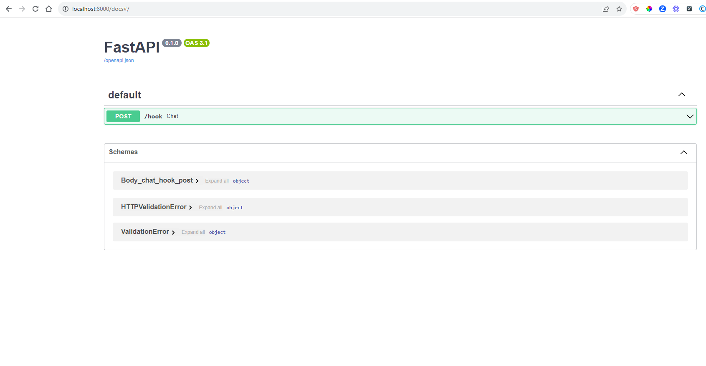

# Twilio-Webhook-FastAPI
Build a Secure Twilio Webhook with Python and FastAPI

## Installation
Install all packages inside "requirements.txt"

## Screenshots
**FastAPI Documentation**

**Ngrok**

**Test Post**

**Test Post (Failed validation)**

https://dialogflowservice-9127.twil.io/dialogflow

ngrok http --domain=living-optimal-seahorse.ngrok-free.app 8000

https://living-optimal-seahorse.ngrok-free.app

FormData([('SmsMessageSid', 'SM4280f016080356327ee853de9bfe81ac'), ('NumMedia', '0'), ('ProfileName', 'Musa Wakili ML🤖'), ('SmsSid', 'SM4280f016080356327ee853de9bfe81ac'), ('WaId', '2348135810804'), ('SmsStatus', 'received'), ('Body', 'Y'), ('To', 'whatsapp:+14155238886'), ('NumSegments', '1'), ('ReferralNumMedia', '0'), ('MessageSid', 'SM4280f016080356327ee853de9bfe81ac'), ('AccountSid', 'ACfc7cfc9003e361202b7ae65664ed818a'), ('From', 'whatsapp:+2348135810804'), ('ApiVersion', '2010-04-01')])

FormData([('SmsMessageSid', 'SM3a04b1bfcb21ff8f403ebebfbed315d4'), ('NumMedia', '0'), ('ProfileName', 'Musa Wakili ML🤖'), ('SmsSid', 'SM3a04b1bfcb21ff8f403ebebfbed315d4'), ('WaId', '2348135810804'), ('SmsStatus', 'received'), ('Body', 'H'), ('To', 'whatsapp:+14155238886'), ('NumSegments', '1'), ('ReferralNumMedia', '0'), ('MessageSid', 'SM3a04b1bfcb21ff8f403ebebfbed315d4'), ('AccountSid', 'ACfc7cfc9003e361202b7ae65664ed818a'), ('From', 'whatsapp:+2348135810804'), ('ApiVersion', '2010-04-01')])