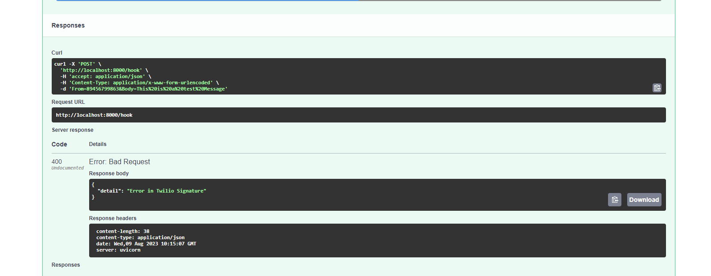

# Twilio-Webhook-FastAPI
Build a Secure Twilio Webhook with Python and FastAPI

## Installation
Install all packages inside "requirements.txt"

## Screenshots
**FastAPI Documentation**

**Ngrok**

**Test Post**

**Test Post (Failed validation)**

